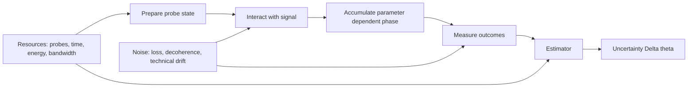

# Quantum Sensing

Quantum sensing treats measurement as a controlled parameter-estimation problem. A probe is prepared in a known quantum state, allowed to interact with an unknown physical parameter, and then measured so that the parameter can be inferred. The parameter might be a magnetic field, acceleration, rotation, gravitational potential, frequency shift, optical phase, force, or a tiny displacement. The central question is not merely whether the parameter can be detected, but how precisely it can be estimated under a specified resource budget: number of probes, interrogation time, optical power, energy, bandwidth, volume, or damage allowed to a sample.

The subject sits between [quantum mechanics](/physics/quantum-mechanics/), statistical estimation, and experimental device physics. Quantum effects matter because probes can be prepared in superposition, entangled across many particles, spin-squeezed to redistribute uncertainty, or read out with photon-counting and phase-sensitive measurements. These features can improve sensitivity, bandwidth, spatial resolution, or calibration stability, but they do not remove ordinary constraints such as loss, technical noise, decoherence, finite duty cycle, and imperfect readout.

## Definitions

**Quantum metrology** is the use of quantum systems and quantum measurement theory to estimate parameters as precisely as possible. In its simplest mathematical form, an unknown scalar parameter $\theta$ is encoded into a probe state:

$$
\rho_\theta = \mathcal{E}_\theta(\rho_0),
$$

where $\rho_0$ is the prepared probe state and $\mathcal{E}_\theta$ is the parameter-dependent evolution. For a closed system this is often a unitary channel

$$
\rho_\theta = U_\theta \rho_0 U_\theta^\dagger,
\qquad
U_\theta = e^{-i\theta G},
$$

with generator $G$. In an interferometer, $\theta$ may be an optical phase and $G$ may be a photon-number difference. In Ramsey spectroscopy, $\theta = \omega T$ is the phase accumulated during free evolution time $T$. In magnetometry, $\theta = \gamma B T$ is a magnetic-field-dependent spin phase.

A **probe state** is the quantum state used to interrogate the signal. It may be a single spin, a single atom, an optical mode, a Bose-Einstein condensate, a squeezed optical field, a many-atom clock ensemble, or an entangled state such as a GHZ or NOON state. The probe is valuable only relative to a resource count. A statement like "Heisenberg scaling" is ambiguous unless one says what counts as a resource: particles, photons, energy, time, total number of experimental repetitions, or all of them together.

A **signal Hamiltonian** describes how the unknown parameter couples to the probe. A common model is

$$
H_\theta = \hbar \theta G,
$$

or, for a two-level spin sensor in a magnetic field,

$$
H_B = \frac{\hbar \gamma B}{2}\sigma_z,
$$

where $\gamma$ is the gyromagnetic ratio. After interrogation time $T$, the spin accumulates phase $\theta = \gamma B T$.

A **measurement** is described by a positive-operator-valued measure, or POVM, $\{M_y\}$ with outcome probabilities

$$
p(y\mid \theta) = \mathrm{Tr}(M_y \rho_\theta).
$$

Those outcome probabilities define a classical statistical model. The **classical Fisher information** for a discrete measurement is

$$
F_\theta =
\sum_y p(y\mid \theta)
\left(
\frac{\partial}{\partial \theta}\log p(y\mid \theta)
\right)^2
=
\sum_y
\frac{1}{p(y\mid \theta)}
\left(
\frac{\partial p(y\mid \theta)}{\partial \theta}
\right)^2.
$$

For $\nu$ independent repetitions of the same experiment, the Fisher information adds: $F_\theta^{(\nu)} = \nu F_\theta$. Under standard regularity assumptions, any unbiased estimator $\hat{\theta}$ obeys the **classical Cramer-Rao bound**

$$
\Delta \theta =
\sqrt{\mathrm{Var}(\hat{\theta})}
\ge
\frac{1}{\sqrt{\nu F_\theta}}.
$$

The **quantum Fisher information** $F_Q(\theta)$ maximizes the classical Fisher information over all allowed measurements:

$$
F_Q(\theta) = \max_{\{M_y\}} F_\theta(\{M_y\}).
$$

It leads to the **quantum Cramer-Rao bound**

$$
\Delta \theta \ge \frac{1}{\sqrt{\nu F_Q(\theta)}}.
$$

For a pure state $\vert \psi_0\rangle$ evolving by $U_\theta=e^{-i\theta G}$, the quantum Fisher information is especially simple:

$$
F_Q = 4(\Delta G)^2_{\psi_0}.
$$

This formula makes the physics transparent. A probe estimates $\theta$ well when the initial state has a large spread over eigenvalues of the generator $G$, because a large generator variance makes the state change rapidly as $\theta$ changes.

## Key results

### Fisher information in Ramsey interferometry

A single two-level Ramsey probe begins in

$$
|+\rangle = \frac{|0\rangle + |1\rangle}{\sqrt{2}}.
$$

During free evolution it acquires a relative phase:

$$
|\psi_\theta\rangle =
\frac{|0\rangle + e^{-i\theta}|1\rangle}{\sqrt{2}}.
$$

After a final analysis pulse, a computational-basis measurement has probabilities

$$
p_0(\theta)=\frac{1+\cos\theta}{2},
\qquad
p_1(\theta)=\frac{1-\cos\theta}{2}.
$$

The derivatives are

$$
\frac{\partial p_0}{\partial \theta}=-\frac{\sin\theta}{2},
\qquad
\frac{\partial p_1}{\partial \theta}=\frac{\sin\theta}{2}.
$$

The Fisher information is therefore

$$
\begin{aligned}
F_\theta
&=
\frac{(\partial_\theta p_0)^2}{p_0}
+ \frac{(\partial_\theta p_1)^2}{p_1} \\
&=
\frac{\sin^2\theta}{4}
\left(
\frac{1}{p_0}+\frac{1}{p_1}
\right) \\
&=
\frac{\sin^2\theta}{4}
\left(
\frac{p_0+p_1}{p_0p_1}
\right) \\
&=
\frac{\sin^2\theta}{4}
\left(
\frac{1}{\sin^2\theta/4}
\right) \\
&= 1,
\end{aligned}
$$

away from points where the displayed measurement basis has zero slope and an adaptive phase setting is needed. With $N$ independent probes, Fisher information adds, so $F_\theta=N$ and

$$
\Delta\theta_{\mathrm{SQL}} \ge \frac{1}{\sqrt{\nu N}}.
$$

This $1/\sqrt{N}$ scaling is the **standard quantum limit** (SQL), also called shot-noise scaling. It is not "classical" because the probes may be quantum systems; it is the scaling obtained when each probe contributes independent information.

### Standard quantum limit and Heisenberg limit

Entangled probes can have a generator variance that grows as $N^2$ rather than $N$. A canonical example is a GHZ state of $N$ two-level probes,

$$
|\mathrm{GHZ}\rangle =
\frac{|0\rangle^{\otimes N} + |1\rangle^{\otimes N}}{\sqrt{2}}.
$$

If each excited component accumulates phase $\theta$, the state becomes

$$
|\psi_\theta\rangle =
\frac{|0\rangle^{\otimes N} + e^{-iN\theta}|1\rangle^{\otimes N}}{\sqrt{2}}.
$$

The phase has been amplified by $N$. An ideal parity-type measurement has fringes

$$
p_+(\theta)=\frac{1+\cos(N\theta)}{2},
\qquad
p_-(\theta)=\frac{1-\cos(N\theta)}{2},
$$

and the same Fisher-information calculation gives

$$
F_\theta = N^2.
$$

Thus

$$
\Delta\theta_{\mathrm{HL}} \ge \frac{1}{\sqrt{\nu}N}.
$$

This $1/N$ scaling is the **Heisenberg limit** for a fixed number of probes per trial. It is the same idea behind optical NOON states,

$$
|\mathrm{NOON}\rangle =
\frac{|N\rangle_a|0\rangle_b + |0\rangle_a|N\rangle_b}{\sqrt{2}},
$$

where a phase shift in one interferometer arm produces

$$
|\psi_\theta\rangle =
\frac{e^{-iN\theta}|N\rangle_a|0\rangle_b + |0\rangle_a|N\rangle_b}{\sqrt{2}}.
$$

The important warning is that the Heisenberg limit is a scaling law for an ideal resource model. NOON and GHZ states are fragile: losing one photon or dephasing one spin can destroy the phase relation that carried the $N$-fold enhancement. In many practical sensors, a moderate amount of squeezing gives a robust improvement while a maximally entangled state gives worse performance once loss and dead time are counted.

### Physical platforms


*Figure: Nitrogen-vacancy center in diamond, a common solid-state quantum sensor. Image: [Wikimedia Commons](https://commons.wikimedia.org/wiki/File:Nitrogen-vacancy_center.png), NIST, public domain.*

**NV centers in diamond.** A nitrogen-vacancy center is a point defect consisting of a substitutional nitrogen atom next to a vacancy in diamond. Its electronic ground state is a spin triplet, with magnetic sublevels often labeled $m_s=0$ and $m_s=\pm 1$. In many magnetometry experiments, $m_s=0$ and one of the $m_s=\pm 1$ states form an effective two-level sensor. Optical excitation polarizes the spin and spin-dependent fluorescence enables optically detected magnetic resonance (ODMR). NV sensors are useful because diamond is chemically robust, can host near-surface defects, and can operate from cryogenic conditions to room temperature. Applications include nanoscale magnetometry, current imaging, materials characterization, biology-compatible magnetic sensing, and microscale or nanoscale MRI concepts.

**Atomic clocks.** Atomic clocks estimate frequency by comparing a local oscillator to a narrow atomic transition. Caesium fountain clocks define the SI second through the microwave hyperfine transition of $^{133}\mathrm{Cs}$, while optical clocks based on ions or neutral atoms such as Sr, Yb, and Hg use much higher transition frequencies and can reach fractional frequency uncertainty or instability in the low $10^{-18}$ range in leading laboratory systems. Clock comparisons are sensors of gravitational potential through relativistic redshift, tests of fundamental constants, and probes of possible new physics. They are also infrastructure for navigation, timing networks, geodesy, and frequency metrology.

**Atom interferometry.** Cold atoms can be split, redirected, and recombined by light pulses in a Mach-Zehnder-like sequence. The phase difference between the two paths depends on acceleration, rotation, gravity gradients, and recoil. Atom interferometers are used for gravimetry, gyroscopy, tests of the equivalence principle, measurements of fundamental constants, and gradiometers. The sensor is attractive because atoms are nearly identical inertial test masses, but the apparatus must manage vibration isolation, wavefront errors, laser phase noise, finite temperature, and cycle time.

**Squeezed light.** Optical interferometers such as ground-based gravitational-wave detectors are limited in part by quantum fluctuations of light. Injecting squeezed vacuum can reduce uncertainty in the measured optical quadrature. In gravitational-wave observatories this improves the quantum-noise contribution to strain sensitivity over important bands, although optical loss, mode mismatch, phase noise, and radiation-pressure back-action determine the realized benefit. Squeezing is a mature example of quantum sensing because it improves a real scientific instrument rather than only a laboratory benchmark.

**Spin-squeezed Bose-Einstein condensates and atomic ensembles.** Spin squeezing creates collective states whose noise is reduced in one spin component at the cost of increased noise in a conjugate component. These states can improve Ramsey spectroscopy, compact inertial sensors, accelerometers, gravimeters, and clocks. The practical challenge is to create useful squeezing while maintaining coherence, atom number, contrast, and readout efficiency.

**Photon-counting sensors.** Single-photon avalanche diodes, superconducting nanowire single-photon detectors, transition-edge sensors, and related devices are not always "quantum sensors" in the entanglement-enhanced metrology sense, but they are essential quantum measurement devices. They detect individual quanta and enable low-light astronomy, fluorescence microscopy, lidar, quantum communication, biological imaging with reduced illumination dose, and time-correlated single-photon counting. Their advantages are high sensitivity and timing resolution; their limits include dark counts, dead time, afterpulsing, saturation, cryogenic requirements for some technologies, and detector calibration.

## Visual



| Platform | Parameter sensed | Typical sensitivity or scale | Frequency or time range | Maturity |
|---|---|---:|---|---|
| NV centers in diamond | Magnetic field, local spin environment, temperature or strain with suitable protocols | Single-NV nanoscale sensing often nT to microT per $\sqrt{\mathrm{Hz}}$ depending on readout; ensembles can reach much lower field noise over larger volumes | DC to MHz-scale protocols, set by coherence and pulse control | Active research and growing applied instrumentation |
| Atomic clocks | Frequency, time, gravitational potential, possible constant variation | Leading optical clocks operate around fractional $10^{-18}$ performance levels under controlled conditions | Seconds to days of averaging; optical carrier frequencies | Metrology-grade for clocks, field deployment still selective |
| Atom interferometers | Acceleration, rotation, gravity, gravity gradient, recoil | Competitive gravimetry and inertial sensing; performance strongly depends on vibration control and interrogation time | Pulse sequences from milliseconds to seconds | Laboratory mature, deployable systems emerging |
| Squeezed-light interferometers | Optical phase, displacement, gravitational-wave strain | Quantum-noise reduction by injected squeezing, limited by loss and control noise | Audio-band gravitational-wave detection and optical readout bands | Operational in major gravitational-wave detectors |
| Spin-squeezed ensembles or BECs | Collective phase, acceleration, gravity, clock frequency | Below-SQL phase noise when squeezing survives state preparation and readout | Usually narrowband or pulsed, set by trap and coherence time | Strong laboratory demonstrations |
| Photon-counting sensors | Individual photons, weak fluorescence, arrival time, low-light images | Single-photon sensitivity; timing from ps to ns in suitable devices | Optical to near-infrared, device dependent | Commercially mature in several detector families |

An ASCII view of the two main scaling laws is useful:

```text
Uncertainty in phase estimation

Delta theta
  ^
  | SQL:        1/sqrt(N)
  |             \
  |              \
  |               \
  | Heisenberg:    \____  1/N
  |                 \
  +------------------------------> N probes
       1      10      100
```

## Worked example 1: SQL versus Heisenberg scaling for ten probes

**Problem.** Compare the phase uncertainty for $N=10$ independent Ramsey probes at the standard quantum limit with an ideal $N=10$ entangled GHZ or NOON probe at the Heisenberg limit. Use one experimental block and ignore constant prefactors.

**Step 1: Write the SQL scaling.** For independent probes, Fisher information adds:

$$
F_{\mathrm{SQL}} = N.
$$

The Cramer-Rao bound gives

$$
\Delta\theta_{\mathrm{SQL}}
\ge
\frac{1}{\sqrt{F_{\mathrm{SQL}}}}
=
\frac{1}{\sqrt{N}}.
$$

With $N=10$,

$$
\Delta\theta_{\mathrm{SQL}}
\ge
\frac{1}{\sqrt{10}}
\approx 0.316.
$$

**Step 2: Write the Heisenberg scaling.** For an ideal entangled state with $N$-fold phase accumulation,

$$
F_{\mathrm{HL}} = N^2.
$$

Thus

$$
\Delta\theta_{\mathrm{HL}}
\ge
\frac{1}{\sqrt{F_{\mathrm{HL}}}}
=
\frac{1}{N}.
$$

With $N=10$,

$$
\Delta\theta_{\mathrm{HL}}
\ge
\frac{1}{10}
= 0.100.
$$

**Step 3: Compute the improvement factor.** The improvement is the SQL uncertainty divided by the Heisenberg-limited uncertainty:

$$
\begin{aligned}
\mathrm{improvement}
&=
\frac{\Delta\theta_{\mathrm{SQL}}}{\Delta\theta_{\mathrm{HL}}} \\
&=
\frac{1/\sqrt{10}}{1/10} \\
&=
\frac{10}{\sqrt{10}} \\
&=
\sqrt{10} \\
&\approx 3.16.
\end{aligned}
$$

**Checked answer.** Ten perfectly entangled probes improve the phase uncertainty by a factor of $\sqrt{10}\approx 3.16$ compared with ten independent probes, under the same idealized resource count. If the whole experiment is repeated $\nu$ times, both uncertainties acquire the same extra factor $1/\sqrt{\nu}$, so the relative improvement remains $\sqrt{10}$.

## Worked example 2: NV-center Ramsey magnetometry estimate

**Problem.** Estimate the magnetic-field sensitivity of an idealized single NV-center Ramsey magnetometer. Suppose the measurement contrast is $C=0.20$, the free precession time is $\tau=10~\mu\mathrm{s}$, the full experimental cycle time is $t_c=20~\mu\mathrm{s}$, and the total integration time is $T_{\mathrm{int}}=1~\mathrm{s}$. Use the electron gyromagnetic ratio

$$
\gamma_e = 2\pi \times 28~\mathrm{GHz/T}
\approx 1.76\times 10^{11}~\mathrm{rad\,s^{-1}\,T^{-1}}.
$$

Assume projection-noise-limited binary readout so that technical photon-shot noise and readout infidelity are ignored.

**Step 1: Relate magnetic field to Ramsey phase.** The field-dependent phase is

$$
\phi = \gamma_e B \tau.
$$

At the most sensitive operating point, the Ramsey signal probability has slope

$$
\left|\frac{\partial p}{\partial B}\right|
=
\frac{C}{2}\gamma_e \tau.
$$

The factor $C$ appears because imperfect contrast reduces the signal swing.

**Step 2: Count independent shots.** The number of cycles in one second is

$$
M =
\frac{T_{\mathrm{int}}}{t_c}
=
\frac{1~\mathrm{s}}{20\times 10^{-6}~\mathrm{s}}
=
50{,}000.
$$

For a binary measurement at quadrature, the standard deviation of the estimated probability is approximately

$$
\sigma_p = \frac{1}{2\sqrt{M}}.
$$

**Step 3: Propagate probability noise into field noise.**

$$
\begin{aligned}
\sigma_B
&=
\frac{\sigma_p}{|\partial p/\partial B|} \\
&=
\frac{1/(2\sqrt{M})}{(C/2)\gamma_e \tau} \\
&=
\frac{1}{C\gamma_e\tau\sqrt{M}}.
\end{aligned}
$$

Insert the numbers:

$$
\begin{aligned}
\sigma_B
&=
\frac{1}{
(0.20)
(1.76\times 10^{11})
(10\times 10^{-6})
\sqrt{50{,}000}
} \\
&=
\frac{1}{
(0.20)
(1.76\times 10^{6})
(223.6)
} \\
&\approx
1.27\times 10^{-8}~\mathrm{T}.
\end{aligned}
$$

**Step 4: Convert units.**

$$
1.27\times 10^{-8}~\mathrm{T}
=
12.7~\mathrm{nT}.
$$

Because the integration time was one second, the corresponding sensitivity is approximately

$$
\eta_B \approx 13~\mathrm{nT}/\sqrt{\mathrm{Hz}}.
$$

**Checked answer.** Under the idealized assumptions, the NV magnetometer reaches about $13~\mathrm{nT}/\sqrt{\mathrm{Hz}}$. Real single-NV experiments may be worse or better depending on fluorescence collection, spin readout protocol, $T_2^*$, pulse overhead, background light, and whether repeated or ensemble readout is available.

## Code

The following Python sketch computes the classical Fisher information for the two-outcome Ramsey measurement above. It also shows why the value is one for an ideal single two-level probe over most phases.

```python
import numpy as np

def ramsey_probabilities(theta):
    """Return p0, p1 for an ideal Ramsey measurement."""
    p0 = 0.5 * (1.0 + np.cos(theta))
    p1 = 0.5 * (1.0 - np.cos(theta))
    return np.array([p0, p1])

def ramsey_derivatives(theta):
    """Return dp0/dtheta, dp1/dtheta."""
    dp0 = -0.5 * np.sin(theta)
    dp1 = 0.5 * np.sin(theta)
    return np.array([dp0, dp1])

def classical_fisher_information(theta, eps=1e-12):
    p = ramsey_probabilities(theta)
    dp = ramsey_derivatives(theta)
    p_safe = np.clip(p, eps, None)
    return np.sum((dp * dp) / p_safe)

thetas = np.linspace(0.05, 2.95, 8)
for theta in thetas:
    print(f"theta={theta:5.2f} rad, F={classical_fisher_information(theta):.6f}")

N = 10
nu = 1
sql_uncertainty = 1.0 / np.sqrt(nu * N)
heisenberg_uncertainty = 1.0 / (np.sqrt(nu) * N)

print("SQL uncertainty:", sql_uncertainty)
print("Heisenberg uncertainty:", heisenberg_uncertainty)
print("Improvement factor:", sql_uncertainty / heisenberg_uncertainty)
```

This code clips probabilities only to avoid division by zero at exactly dark or bright fringes. In an experiment one normally works near a quadrature point or uses adaptive feedback so the chosen measurement has good local slope.

## Common pitfalls

- Confusing the SQL with a non-quantum limit. The SQL is the scaling for independent quantum probes; it is still a quantum measurement limit.
- Quoting Heisenberg scaling without a resource model. The comparison changes if one counts total time, total energy, preparation failures, or adaptive measurements.
- Ignoring decoherence. Independent dephasing often removes the $1/N$ advantage of GHZ-like states, while modest squeezing can remain useful.
- Treating Fisher information as a property of the probe alone. Classical Fisher information depends on the chosen measurement; quantum Fisher information optimizes over measurements.
- Forgetting dynamic range and ambiguity. NOON or GHZ fringes oscillate as $\cos(N\theta)$, so a prior estimate or adaptive protocol is needed to distinguish phases separated by $2\pi/N$.
- Comparing sensitivity numbers from papers without matching assumptions. Bandwidth, averaging time, active volume, contrast, duty cycle, collection efficiency, environmental shielding, and sample damage can change the practical conclusion.
- Assuming every photon-counting or low-noise instrument demonstrates a quantum advantage. A quantum sensor should be compared against the best classical or conventional sensor under the same constraints.
- Equating laboratory sensitivity with field utility. Deployable sensors also need calibration, robustness, size, power control, environmental rejection, and maintainable operation.

## Applications

Quantum sensing is most useful when a physical parameter is weak, localized, or must be measured with a severe resource constraint. In GPS-denied navigation, atom interferometers and advanced clocks can provide inertial or timing information when satellite signals are unavailable or unreliable. Defense-related use cases are usually framed around resilient navigation, timing, and field detection rather than speculative claims of universal target finding.

Biomedical imaging is another major target. NV-diamond magnetometers can measure magnetic fields from spins or currents at small length scales, and photon-counting detectors can improve low-light fluorescence imaging where photodamage matters. Gravity surveying uses atom interferometers or precision gravimeters to detect subsurface density variations relevant to geophysics, civil engineering, mineral exploration, and hydrocarbon exploration, though environmental vibration and survey logistics often dominate performance.

Quantum sensors also support fundamental physics. Clock networks and magnetometers can search for dark matter candidates that would shift constants or produce oscillating fields. Atom interferometers can test gravity, measure constants, and probe equivalence-principle violations. Gravitational-wave detectors use squeezed light to improve astrophysical reach. In all of these applications, the key engineering question is whether the quantum method beats the best non-quantum baseline after stability, bandwidth, size, power, calibration, and cost are included.

## Connections

- [Quantum computing](/quantum-information-science/quantum-computing/) shares hardware with sensing: trapped ions, superconducting circuits, neutral atoms, spins in solids, and photonic systems can be qubits, clocks, or probes depending on how they are controlled and read out.
- [Quantum mechanics](/physics/quantum-mechanics/) supplies the measurement postulates, unitary evolution, spin dynamics, superposition, entanglement, and decoherence models used throughout quantum sensing.
- [Probability and random variables](/math/probability-and-random-variables/) gives the language of likelihoods, variance, independent trials, and Fisher information.
- [Estimation and confidence intervals](/math/statistics/estimation-and-confidence-intervals) connects the Cramer-Rao bound to estimator bias, variance, asymptotic normality, and confidence intervals.
- [Quantum communication](/quantum-information-science/quantum-communication/) overlaps through photon sources, single-photon detectors, squeezed states, and phase-sensitive optical measurement.

## Further reading

- Degen, Reinhard, and Cappellaro, "Quantum Sensing," Reviews of Modern Physics, 2017. This is a broad review of definitions, platforms, and performance metrics.
- Pezze, Smerzi, Oberthaler, Schmied, and Treutlein, "Quantum metrology with non-classical states of atomic ensembles," Reviews of Modern Physics, 2018. This is a detailed reference for spin squeezing and many-body metrology.
- Giovannetti, Lloyd, and Maccone, "Quantum-Enhanced Measurements: Beating the Standard Quantum Limit," Science, 2004, and later follow-up reviews. These papers are standard starting points for Heisenberg scaling and resource-counting issues.
