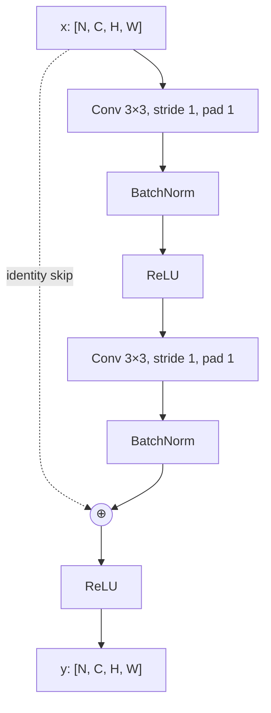
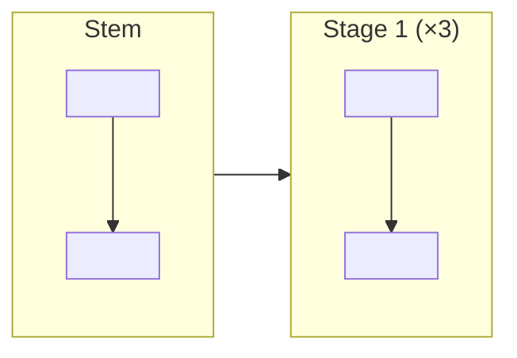

## ARCHITECTURE DIAGRAM POLICY for SJ Wiki

Upgrade Mermaid diagrams across the wiki so they look like **real architecture diagrams**, not toy flowcharts.

### Standard the user expects

The user pointed at the existing detailed Transformer encoder-decoder diagram in `cs/deep-learning/attention-transformers.md` as the **gold standard**: it shows every sublayer (multi-head self-attention, masked self-attention, cross-attention, FFN, Add+LayerNorm), residual paths, encoder→decoder K,V handoff, embedding + positional encoding, output linear+softmax. Match or exceed that level of detail.

### Hard rules

1. **No copyrighted figures**. Do not embed any image. Build Mermaid (or, when Mermaid is too limiting, inline SVG) representations of the *facts* of an architecture from your own understanding. Architectural facts (skip connections, gate equations, layer order, channel dimensions) are not copyrightable; specific figures are. Build your own faithful representation.

2. **Replace, don't append**. Existing pages already have simple Mermaid flowcharts. **Replace** them with detailed versions in the same location. Do not pile on a second diagram next to the old one.

3. **Detail level**:
   - Show **every sublayer / building block** of the architecture (Conv-BN-ReLU-Pool, gate-by-gate LSTM, attention block sub-operations).
   - Include **dimensions / channel counts** where they are standard (e.g., ResNet-50: 7×7 conv 64, /2; 3×3 maxpool /2; stage 1 has 3 bottleneck blocks of [1×1, 64; 3×3, 64; 1×1, 256]; etc.). Use them as labels.
   - Show **residual / skip / shortcut connections** explicitly with separate arrows (use `-.->` dotted style for them when it improves readability).
   - Show **data shape transitions** (e.g., `[N×3×224×224] -> [N×64×112×112]`) on key arrows.
   - Use **subgraphs** for grouped blocks (one bottleneck block, one encoder layer, one Mamba block, etc.).
   - Use **clear node shapes**: rectangles for layers `[ ]`, rounded for blocks `( )`, diamonds for decision/routing `{ }`, double-circle or stadium for final outputs `(( ))` / `([])`.

4. **Mermaid syntax safety**:
   - Wrap any label containing special characters in `"..."` (parens, equals, slash, brackets, commas, ampersands, `{`/`}`, etc.).
   - Use `flowchart TB` for top-to-bottom architecture (matches standard textbook orientation) unless `LR` clearly fits better (e.g., seq2seq pipelines).
   - Test mentally — every `[`, `(`, `{` must be matched. Quote labels.

5. **One detailed diagram per architecture concept**. Each architecture page gets one comprehensive diagram. If a page covers multiple architectures (e.g., `modern-cnns.md` covers AlexNet, VGG, GoogLeNet, ResNet, DenseNet), each gets its own detailed diagram.

6. **Caption requirement**: every replaced diagram is followed by a 2-4 sentence caption that explains what the reader is looking at (mention specific labeled blocks, the shape transitions, the role of skip connections, etc.).

7. **Length budget**: don't worry about page length. Detailed architecture diagrams may add 100-200 lines to a page. That's the right trade.

8. **Do not** add Wikimedia Commons images for architectures (those are mostly missing or copyrighted variants). Mermaid is the canonical answer for AI/ML/QIS architecture pages.

### Style examples for reference

For **per-block detail**, use a nested subgraph:

For **multi-stage pipelines**, group with subgraphs:

### Output expectation

After this pass each architecture-relevant page should answer at a glance:

- *What are the building blocks?* (labeled)
- *In what order?* (arrows)
- *What are the shape transitions?* (annotated on arrows or labels)
- *Where are the shortcuts / residuals / branches?* (explicit)
- *What is the I/O contract?* (input shape, output shape)

If a page already had a detailed diagram (e.g., the Transformer one in `attention-transformers.md`), leave it alone. Don't downgrade.

---

The domain-specific instructions follow below.

---

