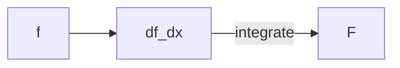

## EXPANSION PASS — SJ Wiki

You are running an **in-place expansion** of an existing wiki subtopic. The pages already exist; your job is to enrich them, **not** rewrite from scratch.

## Inputs

- **TARGET_DIR**: `f:/coding/SJ Wiki/docs/math/calculus/`
- **SOURCE_PDF** (reference): `f:/coding/SJ Wiki/tmp/James Stewart - Essential Calculus_ Early Transcendentals-Brooks Cole (2012) sol.pdf`
- **SUBJECT**: Calculus

## What to do

1. List all `.md` files in TARGET_DIR (skip `_category_.json`).
2. For each `.md` file:
   a. Read the file.
   b. Apply the depth-requirement standard from the addendum at the top of this prompt: 1500-3500 words, mandatory visual (Mermaid/table/ASCII), ≥2 worked examples, common-pitfalls section, code where appropriate.
   c. **Preserve** the existing frontmatter (`title`, `sidebar_position`), filename, slug, and the broad structure of the page. Do **not** delete existing content unless it is clearly wrong.
   d. **Expand in place**: insert new sections (Visual, additional Worked example, Common pitfalls, expanded Connections) where they are missing. Lengthen thin existing sections — definitions that are too terse, theorems without proof sketches, examples that skip steps.
   e. If you need additional content (more examples, geometric intuition, edge cases), reference SOURCE_PDF — use `pdftotext -f X -l Y` on the relevant chapter pages.

3. Do **not** modify `_category_.json`, `intro.md` (it's already a TOC), filenames, frontmatter slugs, or any file outside TARGET_DIR.

4. After you finish, print a summary listing each file you expanded and what was added (one line per file is fine).

## Mermaid quick reference

Docusaurus has the mermaid theme enabled. Use fenced code blocks tagged `mermaid`:

Use Mermaid for: dependency between concepts, integration/differentiation maps, chain-rule trees, optimization decision flow, vector field sketches as graphs, parametric curve evaluation pipelines.

## Visual ideas for calculus pages

- **Limits**: ASCII sketch of $\epsilon$-$\delta$ band, table of one-sided/two-sided limit cases.
- **Derivatives**: Mermaid showing chain-rule composition; table of derivative rules.
- **Applications of derivatives**: optimization decision flowchart in Mermaid.
- **Integrals**: comparison table of substitution / by parts / partial fractions.
- **Series**: convergence-test decision tree in Mermaid; comparison table of tests.
- **Vector calculus**: relationships between grad/div/curl as a Mermaid diagram, Stokes/divergence/Green table.

## Constraints

- Stay inside TARGET_DIR.
- Do not run `npm`.
- English. Mathematically precise.
- Don't fabricate.
- Keep existing cross-links working — when adding new ones use absolute paths like `/math/calculus/derivatives-and-rates`.

Begin now.
